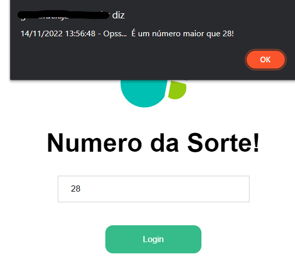
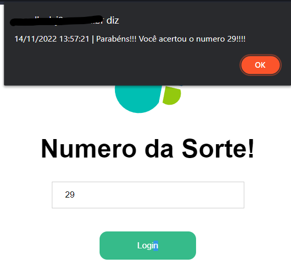

# goodluck
Projeto para simular o uso de CORS no Elasticsearch:

## Pré Reqs

Para executar o código não é necessário um servidor de Backend, basta apenas um servidor Web (Nginx, Apache, IIS).

* Webserver (Nginx, Apache, IIS)
* Elasticsearch
* Criar API Key no Elasticsearch

## Execução

Adicionar o projeto no caminho do Webserver será possível acessar esse home:


Adicionar um índice no Elasticsearch com um número a ser advinhado:

```json
POST numero_sorte/_doc/1
{
    "numero": 29
}
```

Também será necessário adicionar a permissão de CORS no Elasticsearch.
Edite o arquivo elasticsearch.yml conforme exemplo abaixo:


```yaml
# Allow CORS
http.cors.enabled : true
http.cors.allow-origin: http://IP, http://url.teste.com
http.cors.allow-methods: OPTIONS, HEAD, GET, POST, PUT, DELETE
http.cors.allow-headers: Authorization, Content-Type, Origin, Accept, X-Requested-With
http.cors.allow-credentials: true
```

Reinicie o Elasticsearch.

Crie uma API Key com permissão somente de leitura no índice:

```json
POST _security/api_key
{
  "name": "goodluck",
  "role_descriptors": { 
    "role": {
      "index": [
        {
          "names": ["numero_sorte"],
          "privileges": ["read"]
        }
      ]
    }
  }
}
```

Adicione a key gerada (O encoded) no seguinte bloco de código onde está escrito **ENCODED_DA_API_KEY**:

```js
// Storing response
const response = await fetch(url, { 
    method: 'GET', 
    headers: new Headers({
        'Authorization': 'ApiKey ENCODED_DA_API_KEY', 
        'Content-Type': 'application/json'
    }),
});
```

Pronto, agora é só "*Testar sua sorte*"!!

**ERRO**



**ACERTO**


